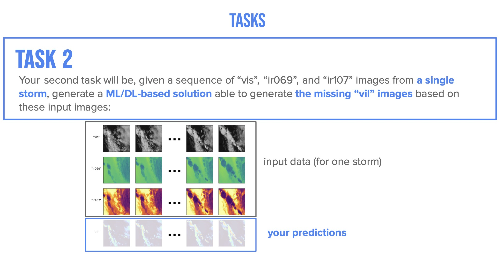
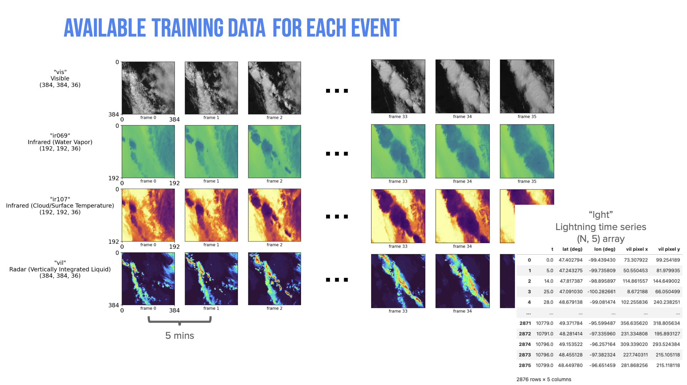

# radar_images_generation
## Project description

The goal of this project is to generate the missing “vil” images based on a sequence of “vis”, “ir069”, and “ir107” images from a single storm.

## Dataset
Each storm has 36 sets of images which are divided based on time order(5 mins). For a set of images, there are 4 types of satellite images: visible, water vapour (infrared), cloud/surface temperature (infrared) and vertically integrated liquid (radar). The whole dataset includes 800 example storms over the entire US.

## Network construction
4 Layers U-Net with SE and CBAM attention mechanism

## Innovation
1. Data generator: Avoiding out of memory problem.
2. Loss function = SSIM(0.3) + Perceptual Loss(0.3) + Gradient Loss(0.2) + L1 Loss(0.2)

## Model performance
| **Dataset** | **LOSS** | **MAE** | **SSIM** |
| :------------------ | :---: | :---: | :---: |
| *training* | 0.4752 | 0.0571 | 0.5659 |
| *validation* | 0.5697 | 0.0656 | 0.4985 |